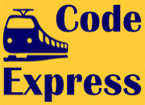

<!-- -- -- -- -- -- -- -- -- -- -- -- -- -- -- -- -- -- -- -- -- -- -- -->

# CodeExpress

We hebben de volgende talen gebruikt voor het bouwen van deze website:
HTML, CSS, JS, PHP, PDO & SQL

 

<!-- -- -- -- -- -- -- -- -- -- -- -- -- -- -- -- -- -- -- -- -- -- -- -->

## 👥 Scrum Team:

- [Joris](https://github.com/139388-Joris-Taam), [Michel](https://github.com/Michel-3),
[Robin](https://github.com/RobinBosma) & [Roger](https://github.com/Rogerdark)

 

<!-- -- -- -- -- -- -- -- -- -- -- -- -- -- -- -- -- -- -- -- -- -- -- -->

## 📃 Links

- [Github](https://github.com/horizoncollege/project-2-verdieping-scrum-codeexpress) 
- [Online Pagina](xxx)

 

<!-- -- -- -- -- -- -- -- -- -- -- -- -- -- -- -- -- -- -- -- -- -- -- -->

## 🛠 Retrospective

Project CodeExpress

### Doorgaan

### Meer

### Minder

### Starten

### Stoppen

<!-- -- -- -- -- -- -- -- -- -- -- -- -- -- -- -- -- -- -- -- -- -- -- -->

## 🤝🏻 Taakverdeling
- [Github](https://github.com/orgs/horizoncollege/projects/39)

