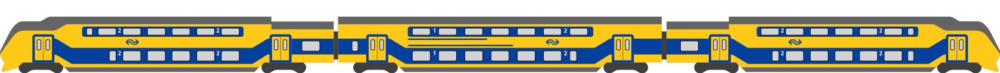

<!-- -- -- -- -- -- -- -- -- -- -- -- -- -- -- -- -- -- -- -- -- -- -- -->

# CodeExpress

Once upon a time, there were four friends named Robin, Michel, Roger, and Joris. They were all passionate about coding and were always looking for new projects to work on. One day, they came up with an idea for a website called CodeExpress, which would allow users to post code to a SQL database and share it with their co-workers. 
 
Excited about their idea, the four friends decided to take on the challenge of building the website within two weeks. Robin, who had a talent for design, took charge of creating the website's layout and visuals. Once he had completed the design, Roger and Joris started working on the backend while Robin and Michel worked on the frontend of the page. 
 
The website had three main pages, namely index.php, code.php, and overview.php. The index page displayed an overview of the website's features, while the code page allowed users to post their code to the database. The overview page provided users with an overview of the codes that had been posted. 
 
Despite encountering a few hurdles along the way, the four friends were determined to complete the project within the given timeframe. They worked tirelessly, day and night, to ensure that the website was functional and user-friendly. 
 
Finally, after two weeks of hard work, the website was completed. The four friends were thrilled with their creation, and they couldn't wait to share it with the world. They launched the website and started promoting it on social media. 
 
Within a few weeks, CodeExpress gained popularity, and it became a hit among developers and coders. The four friends were ecstatic about the success of their project, and they continued to work on improving the website to make it even better. 
 
And so, the story of Robin, Michel, Roger, and Joris came to an end, but their legacy lived on through CodeExpress, a website that brought coders together and made their lives easier.
Once upon a time, there were four friends named Robin, Michel, Roger, and Joris. They were all passionate about coding and were always looking for new projects to work on. One day, they came up with an idea for a website called CodeExpress, which would allow users to post code to a SQL database and share it with their co-workers. 
 
Excited about their idea, the four friends decided to take on the challenge of building the website within two weeks. Robin, who had a talent for design, took charge of creating the website's layout and visuals. Once he had completed the design, Roger and Joris started working on the backend while Robin and Michel worked on the frontend of the page. 
 
The website had three main pages, namely index.php, code.php, and overview.php. The index page displayed an overview of the website's features, while the code page allowed users to post their code to the database. The overview page provided users with an overview of the codes that had been posted. 
 
Despite encountering a few hurdles along the way, the four friends were determined to complete the project within the given timeframe. They worked tirelessly, day and night, to ensure that the website was functional and user-friendly. 
 
Finally, after two weeks of hard work, the website was completed. The four friends were thrilled with their creation, and they couldn't wait to share it with the world. They launched the website and started promoting it on social media. 
 
Within a few weeks, CodeExpress gained popularity, and it became a hit among developers and coders. The four friends were ecstatic about the success of their project, and they continued to work on improving the website to make it even better. 
 
And so, the story of Robin, Michel, Roger, and Joris came to an end, but their legacy lived on through CodeExpress, a website that brought coders together and made their lives easier. 
 
We hebben de volgende talen gebruikt voor het bouwen van deze website: 
HTML, CSS, JavaScript, PHP & SQL

 

<!-- -- -- -- -- -- -- -- -- -- -- -- -- -- -- -- -- -- -- -- -- -- -- -->

## 👥 Scrum Team:

- [Joris](https://github.com/139388-Joris-Taam), [Michel](https://github.com/Michel-3),
[Robin](https://github.com/RobinBosma) & [Roger](https://github.com/Rogerdark)

 

<!-- -- -- -- -- -- -- -- -- -- -- -- -- -- -- -- -- -- -- -- -- -- -- -->

## 📃 Links

- [Github](https://github.com/horizoncollege/project-2-verdieping-scrum-codeexpress) 
- [Online Pagina](https://169849.ao-alkmaar.nl/project-2-verdieping-scrum-codeexpress/page/index.php)

 

<!-- -- -- -- -- -- -- -- -- -- -- -- -- -- -- -- -- -- -- -- -- -- -- -->

## 🛠 Retrospective

Project CodeExpress

### Doorgaan

### Meer

### Minder

### Starten

### Stoppen

<!-- -- -- -- -- -- -- -- -- -- -- -- -- -- -- -- -- -- -- -- -- -- -- -->

## 🤝🏻 Taakverdeling
- [Github](https://github.com/orgs/horizoncollege/projects/39)

